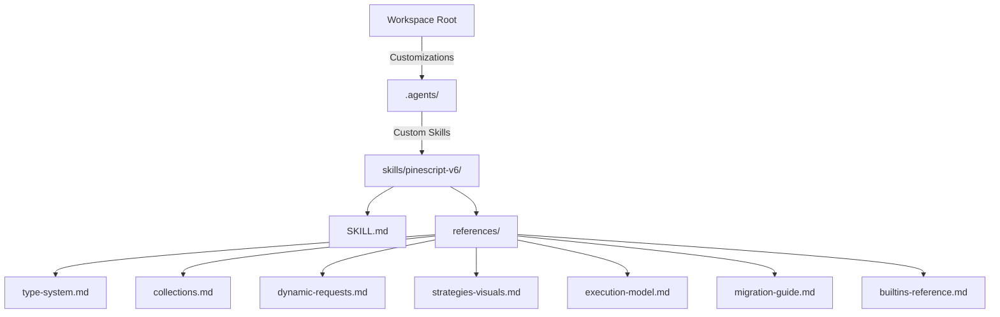

# TradingView Pine Script® v6 Agent Customizations & Skills

```
#
# TradingView Pine Script® v6 Agent Customizations & Skills
#
The **Pine Script® v6 Custom Skills** in this workspace provide up-to-date rules,
reference tables, and coding patterns for writing, refactoring, and debugging
TradingView Pine Script v6 code. They are designed to work with an AI coding agent
and reflect the TradingView Pine Script v6 documentation.
```

---

## 📂 Repository Structure

The custom agent skills are structured under the `.agents/` customizations directory:



### 🔗 Clickable Resource Links

| Resource File | Purpose & Contents |
| :--- | :--- |
| **[SKILL.md](file:///home/nemesis/project/trading-workspace/pinescript/pinescript-skills/.agents/skills/pinescript-v6/SKILL.md)** | The main skill entry point containing core developer rules and trigger definitions. |
| **[Type System Rules](file:///home/nemesis/project/trading-workspace/pinescript/pinescript-skills/.agents/skills/pinescript-v6/references/type-system.md)** | Strict boolean laws, removing `na` from boolean variables, lazy evaluation of `and`/`or` operators. |
| **[Collections & UDTs](file:///home/nemesis/project/trading-workspace/pinescript/pinescript-skills/.agents/skills/pinescript-v6/references/collections.md)** | User-Defined Types (UDTs), custom `method` declarations, historical indexing of object fields `(obj[1]).field`, arrays, maps, and matrices. |
| **[Dynamic Requests](file:///home/nemesis/project/trading-workspace/pinescript/pinescript-skills/.agents/skills/pinescript-v6/references/dynamic-requests.md)** | Performing `request.security()` requests inside local scopes (`if`/`switch` blocks, loops) and arrays of symbols. |
| **[Strategies & Visuals](file:///home/nemesis/project/trading-workspace/pinescript/pinescript-skills/.agents/skills/pinescript-v6/references/strategies-visuals.md)** | Removal of the `when` parameter, default 100% margin, trade limit auto-trimming, `polyline.new()` drawings, and `log.*` outputs. |
| **[Execution Model](file:///home/nemesis/project/trading-workspace/pinescript/pinescript-skills/.agents/skills/pinescript-v6/references/execution-model.md)** | Bar-by-bar execution, variable persistence (`var` and `varip`), barstate flags, and historical buffer management. |
| **[Migration Guide](file:///home/nemesis/project/trading-workspace/pinescript/pinescript-skills/.agents/skills/pinescript-v6/references/migration-guide.md)** | Step-by-step instructions on updating legacy v5 scripts to compile in v6. |
| **[Built-in Reference Manual](file:///home/nemesis/project/trading-workspace/pinescript/pinescript-skills/.agents/skills/pinescript-v6/references/builtins-reference.md)** | Complete index of technical analysis (`ta.*`), math, input forms, environment variables (`syminfo.*`), and drawing namespaces. |

The companion Resource Manual is the same scope as TradingView's Reference Manual: function/constant/type entries for the current major namespaces.

---

## ⚡ Pine Script v6 Quick Cheat Sheet

### 1. Declaring an Enum and Input Dropdown
```pinescript
//@version=6
indicator("MA Switcher", overlay = true)

// Define enum members and their human-readable labels
enum MAType
    SMA = "Simple MA"
    EMA = "Exponential MA"

// input.enum automatically displays a dropdown in script settings
maSelection = input.enum(MAType.SMA, "Moving Average Type")

maValue = switch maSelection
    MAType.SMA => ta.sma(close, 20)
    MAType.EMA => ta.ema(close, 20)
    => na

plot(maValue, color = color.blue)
```

### 2. Accessing Historical Object Fields
```pinescript
type Point
    float price

var myPoint = Point.new(close)

// ❌ INVALID (compiler error)
// float prev = myPoint.price[1]

// ✅ VALID (pattern A)
float prevA = (myPoint[1]).price

// ✅ VALID (pattern B)
float currentPrice = myPoint.price
float prevB = currentPrice[1]
```

### 3. Debug Logging
```pinescript
if barstate.islast
    log.info("Close price: {0}, SMA value: {1}", close, maValue)
```
*Open **Pine Logs** in the TradingView Pine Editor console to inspect logs.*
